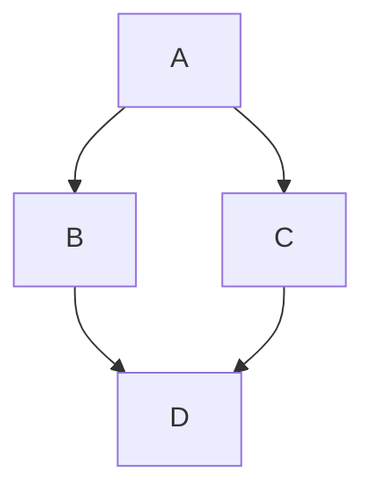

$$ \newcommand\hola[1]{\sqrt[2]{a} = 2} $$

$ tail newcommand-test.tex

\[
\newcommand\mcy{{\mathcal{y}}}
\]

Will this work? \(\mcy = 3\).

\end{document}

$$x \in \mathcal{N}$$

Here is a simple flow chart:

$$ \hola = 2 $$
